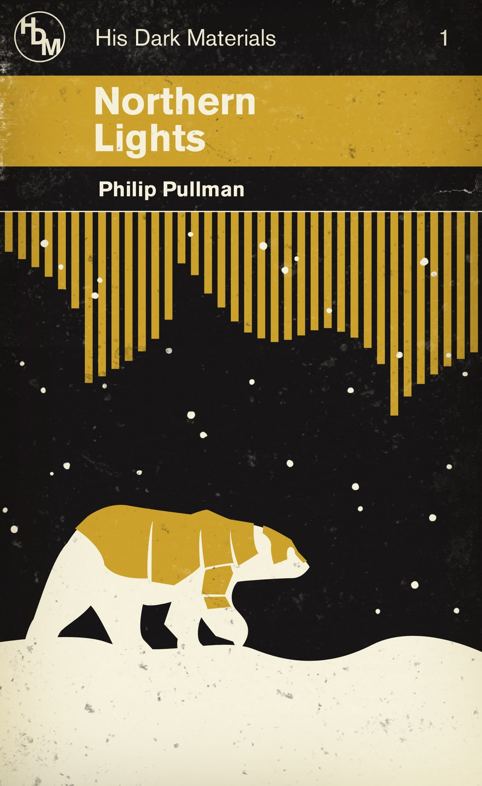

import Paragraph from '../../../components/Paragraph.astro';

<Paragraph>

A headline will come here</ div>

Welcome to my _new blog_ about learning Astro! Here, I will share my learning journey as I build a new website.
1. **Installing Astro**: First, I created a new Astro project and set up my online accounts.

</Paragraph>

<Paragraph>

A headline will come here</ div>

Welcome to my _new blog_ about learning Astro! Here, I will share my learning journey as I build a new website.
1. **Installing Astro**: First, I created a new Astro project and set up my online accounts.

</Paragraph>